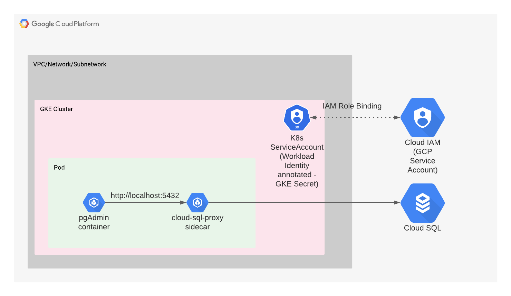

# Deploy a `pgAdmin` Web Application on GKE, Cloud SQL using Terraform

## Introduction

This example demonstrates creating a Kubenernetes cluster in [Googke Kubernetes Engine](https://cloud.google.com/kubernetes-engine/docs/concepts/kubernetes-engine-overview) (GKE) running the [pgAdmin 4](https://github.com/postgres/pgadmin4) web app which has a frontend UI developed using jQuery and Bootstrap, a backend powered by Flask. The `pgAdmin4` workload connects to a [Cloud SQL](https://cloud.google.com/sql/docs/postgres/) instance using the [cloud-sql-proxy](https://cloud.google.com/sql/docs/mysql/connect-kubernetes-engine) "sidecar" container which allows the communication between them. 

The communication between the workload and `cloud sql` instance is achieved by using the [Workload Identity](https://cloud.google.com/kubernetes-engine/docs/how-to/workload-identity) feature which provides the credentials directly to the `cloud-sql-proxy` sidecar container without having to handle the GCP credentials manually.

## Architecture
The GKE cluster is created on a subnet in the default VPC network of the project. The application and its sidecar container are deployed in a single Kubernetes (k8s) pod running on the only node in the Kubernetes Engine cluster. The application communicates with the Cloud SQL instance via the Cloud SQL Proxy process listening on localhost.

The k8s manifest builds a single-replica Deployment object with two containers, pgAdmin and Cloud SQL Proxy. There are two secrets installed into the Kubernetes Engine cluster: the Cloud SQL instance connection information and a service account key credentials file, both used by the Cloud SQL Proxy containers Cloud SQL API calls.

The application doesn't have to know anything about how to connect to Cloud SQL, nor does it have to have any exposure to its API. The Cloud SQL Proxy process takes care of that for the application.




## Prerequisites

### Google Cloud Project

 You'll need access to a Google Cloud Project with billing enabled. See [Creating and Managing Projects](https://cloud.google.com/resource-manager/docs/creating-managing-projects) for creating a new project. To make cleanup easier it's recommended to create a new project.

### Required GCP APIs

The following APIs will be enabled by terraform code:

* Compute Engine API
* Kubernetes Engine API
* Cloud SQL Admin API
* Secret Token API
* Stackdriver Logging API
* Stackdriver Monitoring API
* IAM Service Account Credentials API

### Tools

The following tools are required:

* Access to an existing Google Cloud project.
* Bash or Shell common command line tool.
* [Terraform v0.13.0+](https://www.terraform.io/downloads.html)
* [gcloud v255.0.0+](https://cloud.google.com/sdk/downloads)
* [kubectl](https://kubernetes.io/docs/reference/kubectl/overview/) that matches the latest generally-available GKE cluster version.

# Deployment

### Authenticate gcloud

 Authenticate your gcloud client by running the following command:

```console
gcloud auth login
```

### Configure gcloud settings

Run `gcloud config list` and make sure that `compute/zone`, `compute/region` and `core/project` are populated with appropriate values. You can set their values with the following commands:

```console
# Where the region is us-central1
gcloud config set compute/region us-central1

Updated property [compute/region].
```

```console
# Where the zone inside the region is us-central1-b
gcloud config set compute/zone us-central1-b

Updated property [compute/zone].
```

```console
# Where the project name is my-project-name
gcloud config set project my-project-name

Updated property [core/project].
```

## Set terraform variables

If you wish to override the terraform variables, update the `terraform/terraform.tfvars` file with the desired value.
E.g.
```terraform
project_id = "my-project-id"
region     = "us-central1"
zone       = "us-central1-b"
```
> The `.tfvars` file is usually added in .gitignore, but it's retained here just as an example.

To keep things simple, we're using the values from `db_username` and `db_password` variables as login credentials for both `postgres` database instance and the `pgAdmin` web app. Since pgAdmin mandates that the username should be in an e-mail address form, we're using `pgadmin@postgres.com` as the `db_username`. If you wish to override the username variable, please use an e-mail id form.
## Create Resources

To create the entire environment via Terraform, run the following command from the project root folder:

```bash
./create.sh
```

To deploy the application by applying the k8s manifests located in the `/k8s` directory, run:

```bash
./deploy.sh
```

Once the `pgAdmin` k8s resources are online, connect the postgres db with the client by running:

```bash
./connect-db.sh
```
This script will import the db connection and port-forward the client which can be accessed at http://localhost:8080

> **Tip:** If the scripts require executive permissions, run: `chmod +x script-name.sh`

## Testing the `pgAdmin 4` web application

- Visit http://localhost:8080
- Enter the values from `var.db_username` and `var.db_password` as username and password (default is `pgadmin@postgres.com` and `postgres`).
- After login, from the `Browse` pane on the left, go to `deloitte-challenge-server-group` which we imported earlier and select `Dummy Database` connection.
- When prompted for password, enter the `var.db_password` terraform variable value (default is `postgres`) and click `OK`.
- Now you will be able to browse the databases hosted on the `cloud sql` instance including the database (default is `deloitte-challenge-test-database`) that was created using terraform. Verify by running `terraform output postgres_db_name`.
## Tear Down

To delete all created resources in GCP, run:

```bash
./destroy.sh
```
